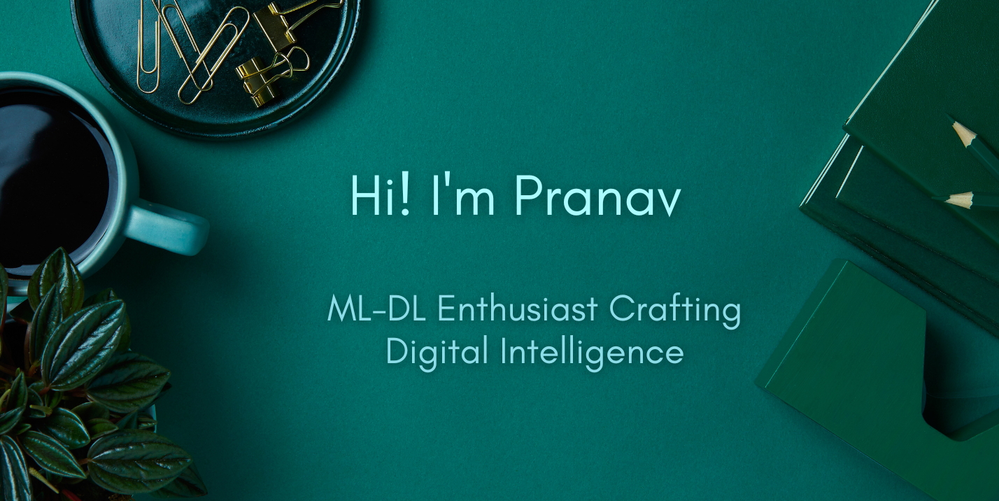

<h1 align="center">Hi 👋, Myself Pranav Pant </h1>
<h3 align="center">An enthusiastic 🎓 student in the realm of ✨ Machine Learning and Deep Learning, a virtuoso 🌐 in the realm of web development and an avid problem-solving 🧩 aficionado in the arena of competitive programming. 🚀</h3>

  

-🚀 Embarking on a journey with **Computer Vision applications - Unveiling Objects and Crafting Images**

- 🌱 Nourishing my mind with the art of **PyTorch, Object Detection, and the Symphony of Sequence Models**

- 📫 You can send a signal to **pant.4@iitj.ac.in**

- 📄 Peep into my chronicles of experience: [Pranav's Odyssey](https://drive.google.com/file/d/1jNOoLp_QNvCckMROh5-geu1L7bxgwGJB/view?usp=drive_link)

- ⚡ Did you know? I wield the keyboard at a blazing<b style="color:cyan"> 138</b>  words per minute! 🌪️

<h3 align="left" style="font-family: 'Roboto', sans-serif; font-size: 28px; color: #00bcd4; text-transform: none; text-shadow: 2px 2px 4px rgba(0, 0, 0, 0.3);">Sync our Digital Presence:</h3>
<!--  -->

&nbsp;&nbsp;
<!-- &nbsp;&nbsp; -->
<!-- &nbsp;&nbsp; -->
&nbsp;&nbsp;
<!-- &nbsp;&nbsp; -->

<h3 align="left" style="font-family: 'Roboto', sans-serif; font-size: 24px; color: #4a90e2; text-shadow: 2px 2px 4px rgba(0, 0, 0, 0.3);">Crafting Code Creations with :</h3>

  

  <h4>🤖 Machine Learning:</h4>
  

    
    
    
    
    <!--  -->
    
    
  

  
  

    <h4>🌐 Web Development:</h4>
    

      
      
      
      <!-- Add more Web Dev tools/icons here -->
    

  

  
 

  <h4>🏆 Competitive Programming:</h4>
  

    
    
    <!--  -->
     
    <!-- Add more CP tools/icons here -->
  

<!-- ## Embracing the Journey 🚀 -->

Thank you for visiting my corner of the digital universe! 🌌 With a heart fueled by curiosity and a passion for coding, I'm constantly exploring the horizons of Machine Learning and Deep Learning crafting elegant Web experiences. 🌟

Remember, every line of code is a stroke of imagination turned into reality. As I continue my journey of growth and innovation, I invite you to embark on your own coding odyssey. Let's create, innovate, and inspire together! 🌈✨

Feel free to connect with me through the links above or drop me an email at [pant.4@iitj.ac.in](mailto:pant.4@iitj.ac.in). Let's build a brighter digital future together! 💻🌠

<!-- Keep coding and keep dreaming!  -->
